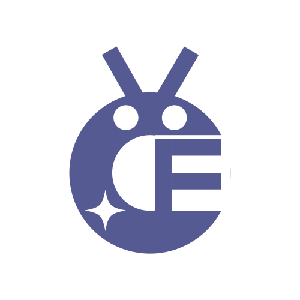
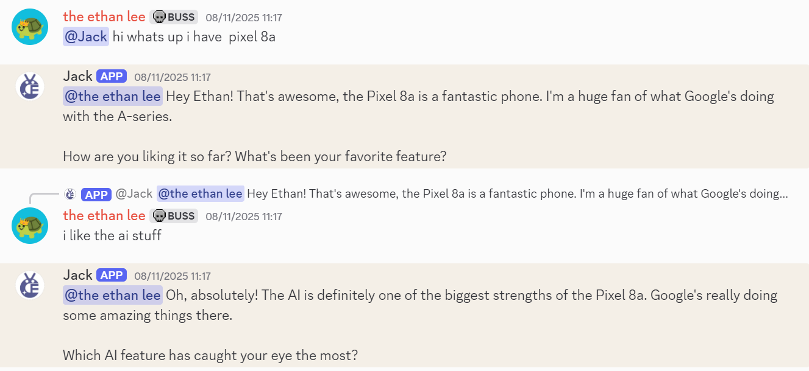
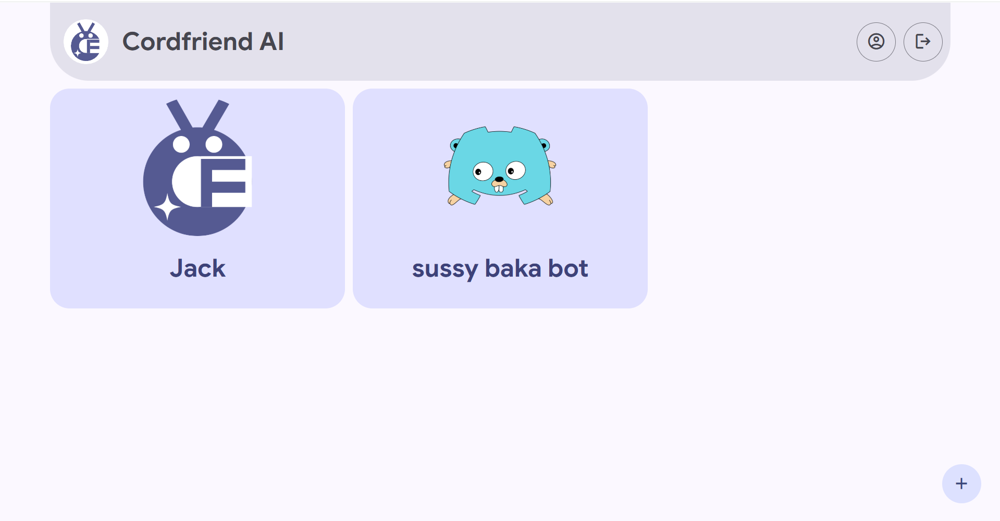
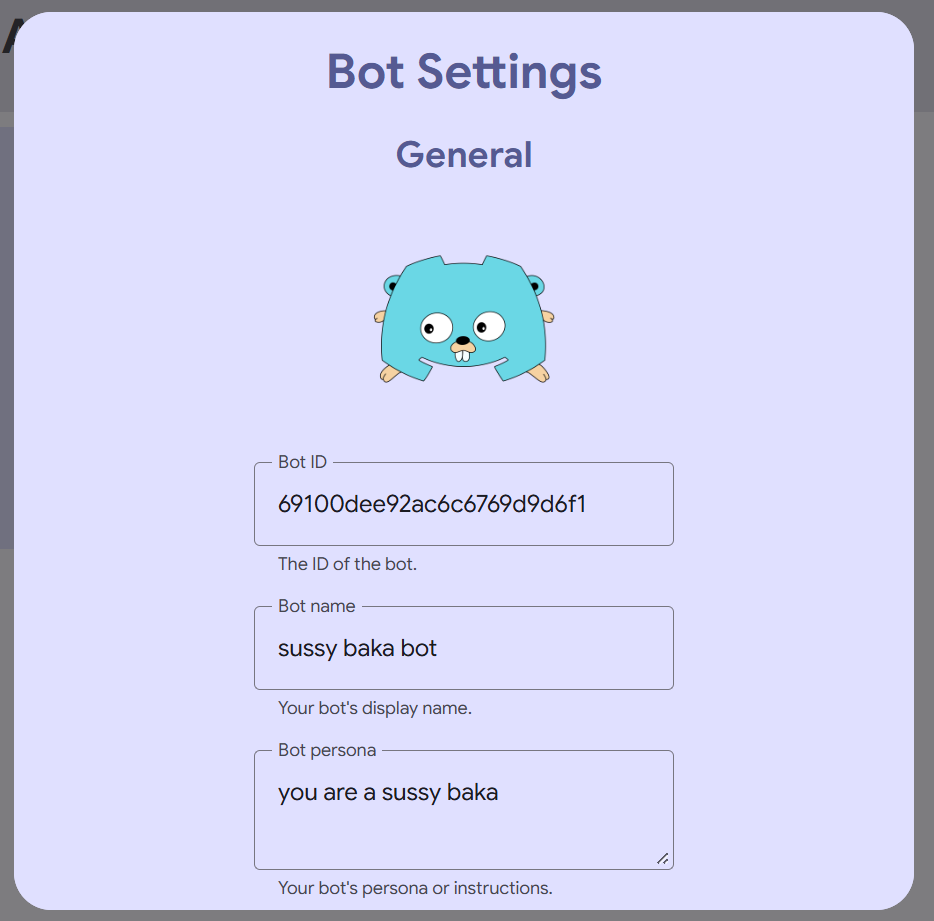

<p align="center">
    <br />
    <h1 align="center">Cordfriend AI</h1>
    <p align="center">A <b>free</b>, <b>open-source</b> AI Discord bot built in Golang.</p>
    <p align="center">
        <a href="#about">About</a> •
        <a href="#features">Features</a> •
        <a href="#development">Development</a> •
        <a href="#contributing">Contributing</a> •
        <a href="#license">License</a>
    </p>
    <hr />
</p>

## About
Cordfriend AI is a free, open-source AI Discord bot, similar to Character AI or Talkie AI - but in Discord. Create your own bots and add them to your Discord server!

## Features
* 🤖 Create and manage 1 bot per server
* 🖌️ Customize your bots with different personas
* 😃 Customize your bots with custom names
* ❇️ Uses Google Gemini API
* ⚡ Built in Go - blazingly fast


<br />

<br />


## Development
### Prerequisites
Before development, please ensure you have the following installed:

* [Go 1.25 or above](https://go.dev/doc/install) (Running the bot)
* [Node.js](https://nodejs.org/download) (Running the website)

### Setup
1. **Clone the repository**
```
git clone https://github.com/ingStudiosOfficial/cordfriendai.git
cd cordfriendai
```

2. **Clone the .env.example file for website and bot**
```
cd website
copy .env.example .env a/
cd ../bot
```

3. **Setup MongoDB Atlas**
Create a MongoDB Atlas database and cluster called ```cordfriendai```.
Get the Node.js driver connection string.
Paste the MongoDB connection string in your ```website/.env``` and ```bot/.env``` files.

4. **Install Node.js packages**
```
cd website
npm install
```

5. **Setup Discord Token**
Go to the [Discord Developer Portal](https://discord.com/developers/applications) and create a new application.
Navigate to the Bot tab and create and copy a new token.
Paste the token in your ```bot/.env``` file.

6. **Setup AES-256 Crypto Encryption**
Generate a 256 bit key and a 128 bit IV for ```website/.env```.
Generate another 256 bit key for ```bot/.env```.

7. **Setup Google OAuth**
Create a new project in [Google Cloud Console](https://console.cloud.google.com). Go to APIs & Services > OAuth Consent Screen > Clients and create a new Web Client. Set your callback and origin URLs. Get your Google client ID and client secret and add them to ```website/.env```. Set you Google callback URL in ```website/.env``` too.

8. **Setup Discord OAuth**
Go to the [Discord Developer Portal](https://discord.com/developers/applications) and navigate to your Discord Application. Go to the OAuth2 tab and get your client ID and client secret and add them to ```website/.env```. Set your Discord callback URL in ```website/.env``` too.

9. **Add Session Secret**
This step is required only if you intend on using session storage instead of JWTs. Create a new session secret in ```website/.env```.

### Running
1. **Run the development build of the website**
```
cd website
npm run dev
```

2. **Start the server**
```
cd website
npm start
```

3. **Run the bot**
```
cd bot
go run main.go
```

### Packaging
1. **Build the website**
```
cd website
npm build
```

2. **Build the bot**
```
cd bot
go build
```

## Contributing
Read [CONTRIBUTING.md](./CONTRIBUTING.md) for more details.

## License
Cordfriend AI is licensed under the Apache 2.0 License.

Read [LICENSE](./LICENSE) for more details.

<hr />

© 2025 (ing) Studios and Ethan Lee